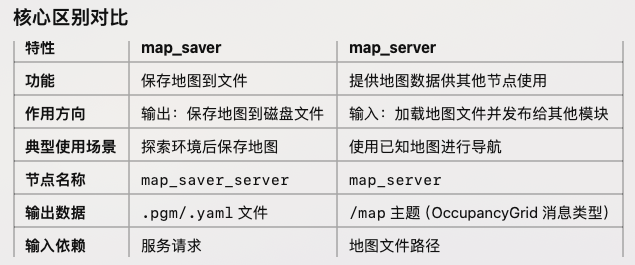
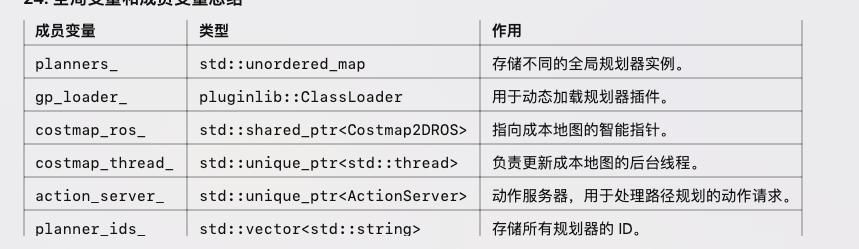

# navigation

## 1.功能包组成
1. nav2_bringup
	•	功能：提供机器人启动导航的默认配置和 launch 文件。用于启动导航堆栈，包含机器人模型、传感器配置、路径规划器、局部控制器等模块。
	•	内容：包括常见的启动文件，适用于不同的机器人配置，可以用于快速启动导航。
	•	用途：用户可以通过修改其中的配置来适配自己的机器人平台。

2. nav2_costmap_2d
	•	功能：提供用于表示机器人周围环境的 2D 成本地图。该地图用于规划路径并帮助机器人避开障碍物。
	•	内容：包括生成和更新成本地图的功能，支持静态障碍物（例如墙壁）和动态障碍物（例如移动的障碍物）的处理。
	•	用途：costmap 被多个模块使用，如路径规划器和局部控制器。

3. nav2_controller
	•	功能：提供局部控制器，用于根据全局规划路径生成机器人实时的运动命令。
	•	内容：包含了多种控制器的实现，如基于 DWA (Dynamic Window Approach) 的控制器，帮助机器人在避开障碍物时生成平滑的运动轨迹。
	•	用途：用于机器人在实际环境中运动时，避开动态障碍物并调整路径。

4. nav2_planner
	•	功能：负责全局路径规划，根据目标位置生成从当前位置到目标位置的路径。
	•	内容：支持多种路径规划算法，例如 A*、Dijkstra 等。可通过配置文件选择适合的规划算法。
	•	用途：提供全局规划的路径，供局部控制器使用。

5. nav2_lifecycle_manager
	•	功能：管理导航堆栈中的生命周期管理。这个包用于管理 ROS 2 生命周期节点，控制导航堆栈中各个模块的启动、停止、恢复等。
	•	内容：它的工作是通过 ROS 2 生命周期管理机制确保系统稳定运行，并在需要时能平滑地恢复。
	•	用途：对导航系统进行管理，保持系统的健康运行状态，进行任务切换、错误恢复等。

6. nav2_map_server
	•	功能：提供静态地图的加载和发布。机器人需要一个地图（通常是 2D 格式）来进行定位和导航。
	•	内容：从文件中加载地图（例如 .pgm 格式的图像文件和 .yaml 格式的配置信息），并通过 ROS 话题发布地图。
	•	用途：供机器人使用的静态地图，可以通过 SLAM 或手动创建的地图。

7. nav2_recovery_behavior
	•	功能：提供一些恢复行为，例如在导航过程中遇到错误或障碍时的回退操作。
	•	内容：包含了一些恢复动作，比如“清理障碍物”、“移动到另一个位置”等，帮助机器人恢复正常工作。
	•	用途：当导航过程出现问题时，recovery_behavior 使机器人能够执行恢复操作并继续任务。

8. nav2_system_tests
	•	功能：提供针对 navigation2 系统的自动化测试套件，确保导航功能的可靠性。
	•	内容：包括对导航堆栈中各个模块的测试，用于验证整个导航系统的功能是否按照预期运行。
	•	用途：帮助开发人员和用户测试导航系统的准确性和稳定性。

9. nav2_util
	•	功能：提供用于导航堆栈的一些实用工具和通用功能。
	•	内容：包括一些常用的类和函数，例如日志记录、参数管理、矩阵和坐标系转换等。
	•	用途：为其他模块提供共享功能，简化开发工作。

10. nav2_behavior_tree
	•	功能：提供行为树（Behavior Tree）支持，用于任务执行和状态管理。
	•	内容：实现行为树节点，允许用户定义复杂的任务流程，并能在运行时动态调整。
	•	用途：通过行为树的方式来管理机器人的任务执行流程，例如导航任务、障碍物避让、任务失败恢复等。

11. nav2_tests
	•	功能：提供一些单元测试和集成测试，验证 navigation2 中各个功能模块的正确性。
	•	内容：包含了对 navigation2 各个子模块的测试，如路径规划器、控制器等。
	•	用途：用于开发过程中确保系统各部分的正确性。

12. nav2_tutorials
	•	功能：提供一些基础教程，帮助用户快速上手 navigation2 的使用。
	•	内容：包含示例代码、配置文件和实践教程，讲解如何配置和使用导航堆栈。
	•	用途：适合入门者，帮助用户学习如何在实际环境中使用 navigation2 进行导航。

## 2.学习顺序
（1）nav2_bringup
	•	功能：快速启动导航系统。
	•	学习内容：
	•	学习如何启动导航系统。
	•	修改 launch 文件适配自己的机器人模型。
	•	步骤：
	1.	使用示例启动文件：
    ros2 launch nav2_bringup bringup_launch.py

（2）nav2_map_server
	•	功能：加载和发布静态地图。
	•	学习内容：
	•	学习如何配置地图文件（.pgm 和 .yaml）。
	•	理解静态地图的作用。
	•	步骤：
	1.	通过 SLAM 创建地图，或者使用已有地图。
	2.	启动地图服务：
    ros2 run nav2_map_server map_server --ros-args -p yaml_filename:=<path_to_map.yaml>

（3）nav2_costmap_2d
	•	功能：生成成本地图。
	•	学习内容：
	•	学习成本地图的配置，包括静态障碍物和动态障碍物。
	•	理解成本地图在路径规划中的作用。
	•	步骤：
	1.	修改配置文件调整成本地图参数（如分辨率、障碍物膨胀半径）。
	2.	可视化成本地图（通过 Rviz）

（4）nav2_planner
	•	功能：全局路径规划。
	•	学习内容：
	•	学习路径规划算法（A*、Dijkstra 等）。
	•	配置全局规划器的参数文件。
	•	步骤：
	1.	使用默认配置启动规划器。
	2.	在 Rviz 中设置目标点，观察规划路径。

（5）nav2_controller
	•	功能：局部路径控制。
	•	学习内容：
	•	理解局部控制器的作用（基于全局路径生成实时控制命令）。
	•	配置控制器参数（如 DWA 控制器的速度限制）。
	•	步骤：
	1.	配置局部控制器，调整速度和避障参数。
	2.	在模拟环境中观察机器人运动。

（6）nav2_behavior_tree
	•	功能：任务管理。
	•	学习内容：
	•	学习行为树的结构。
	•	理解任务如何被拆分并动态调整。
	•	步骤：
	1.	修改行为树 XML 文件，定义自定义任务流程。
	2.	使用行为树调试工具进行验证。

（7）nav2_recovery_behavior
	•	功能：导航过程中错误恢复。
	•	学习内容：
	•	学习恢复行为的种类（如清除成本地图、回退等）。
	•	理解如何配置恢复行为。
	•	步骤：
	1.	设置恢复行为的优先级。
	2.	模拟导航失败场景，观察恢复动作。

（8）nav2_tutorials
	•	功能：提供学习导航功能的示例。
	•	学习内容：
	•	学习如何结合多个功能模块完成机器人导航。
	•	步骤：
	1.	根据教程运行示例代码。
	2.	深入研究每个教程的实现细节。

## 3.学习
### 3.1 nav2_bringup
它的主要作用是方便用户通过统一的启动文件来启动和配置 Navigation2 中的各个功能模块。
•	用户可以通过修改启动文件或参数文件，调整各模块的配置，方便调试和开发。
•	支持对单独模块的启动和测试（例如仅启动 AMCL 或 SLAM 节点）。

### 3.2 nav2_map_server

1. 

#### 3.2.1 终端使用
1. 保存地图
   ros2 service call /map_saver/save_map nav2_msgs/srv/SaveMap "{map_url: '/home/user/my_map'}"
2. 加载地图
   ros2 run nav2_map_server map_server --ros-args -p yaml_filename:=/home/user/my_map.yaml

### 3.3 nav2_costmap_2d

1. 作用：nav2_costmap_2d 将机器人周围的环境表示为一个二维网格，每个网格单元 (cell) 可以包含不同的值，这些值表示该区域的状态，如障碍物、自由空间等

2. nav2_costmap_2d 主要由以下几个部分组成：
    1. 组成部分
        1. Global Costmap：
      	•	它表示整个环境的静态信息，比如静态障碍物或已知的地图信息。用于全局路径规划。
      	2.	Local Costmap：
      	•	它表示机器人周围的一小块环境，包含动态障碍物等信息。用于局部路径规划和避障。
      	3.	Costmap 更新器：
      	•	用于从传感器数据（如激光雷达、深度摄像头等）中获取信息，并更新 costmap。
      	4.	传感器数据接口：
      	•	提供传感器数据（如雷达扫描、深度图等）来动态更新 costmap。

   2. 常见参数 
        1. footprint：
      	•	机器人占据的物理空间，可以是机器人的轮廓，用于计算碰撞检测。
      	2.	robot_radius：
      	•	机器人半径，用于确定一个区域是否被认为是“障碍物”。
      	3.	inflation_radius：
      	•	用于膨胀障碍物的半径，使得机器人不会靠近障碍物。
      	4.	obstacle_range：
      	•	激光扫描数据的有效距离，超过此范围的数据不会被用于更新 costmap。
      	5.	raytrace_range：
      	•	用于计算障碍物和机器人的相对位置，通常和雷达的扫描范围相关。
      	6.	update_frequency：
      	•	更新频率，控制 costmap 更新的速率。

    3. 应用场景
      	1.	静态地图加载：
      	•	机器人可以将 nav2_costmap_2d 加载一个静态地图，用于全局路径规划，确定一个最佳路线来避免障碍物。
      	2.	动态避障：
      	•	在机器人运行时，它会实时更新 costmap 以识别新的障碍物，并在导航时实时避开这些障碍物。
      	3.	局部路径规划：
      	•	在机器人靠近障碍物时，costmap_2d 会帮助局部路径规划器计算避障路线，以确保机器人安全行驶。
      	4.	全局路径规划：
      	•	通过提供全局障碍物信息，costmap_2d 可帮助全局路径规划器计算从起点到目标点的最佳路线。
    
3. 话题
    •	输入话题：
	•	/scan 或 /base_scan：提供环境中障碍物的信息，构建障碍物地图，帮助避障。
	•	/odom：提供机器人的位置信息和运动数据，用于更新机器人当前位置。
	•	/tf：提供坐标系之间的变换数据，确保不同坐标系间的数据能够互相转换
	•	输出话题：
	•	/map 或 /global_costmap（全局代价地图）
	•	/local_costmap（局部代价地图）
	•	/tf_static（静态变换数据）

### 3.4 nav2_planner
1. 主要功能
	1.	全局路径规划：
	•	nav2_planner 负责根据全局代价地图（global_costmap）为机器人规划一个从当前位置到目标位置的全局路径。它根据传感器数据（如激光雷达和里程计）和机器人的代价地图，确定哪些区域可行驶，哪些区域是障碍物。
	•	全局路径规划通常在机器人的起始位置和目标位置之间进行，不考虑即时的动态障碍。
	2.	局部路径规划：
	•	nav2_planner 可以与其他模块（如 nav2_controller）一起工作，提供局部路径规划功能。局部路径规划考虑到实时的障碍物信息并根据机器人的即时环境进行调整，确保机器人在执行全局路径规划时避免新的障碍。
	3.	生成路径：
	•	使用指定的路径规划算法（如 A*、Dijkstra、快速扩展随机树（RRT）等），nav2_planner 会根据全局代价地图生成一条有效的路径，并将其传递给控制器和执行器来执行。
	4.	路径平滑与优化：
	•	规划出的路径通常是由多个离散的点组成的直线段。nav2_planner 可以使用平滑算法（如曲线拟合、样条插值等）来使得路径更加平滑，以避免机器人运动时出现剧烈转弯或不自然的路径。

2. 典型的工作流程
	1.	接收目标：机器人接收到一个目标位置（如目标坐标）后，nav2_planner 会基于当前的地图信息开始规划路径。
	2.	执行全局路径规划：nav2_planner 使用全局代价地图进行路径规划，生成一条从当前位置到目标位置的路径。
	3.	局部避障与路径修正：在机器人行驶过程中，nav2_planner 可以与 nav2_controller 配合进行局部避障，实时修正路径。
	4.	传递路径：当路径规划完成，nav2_planner 会将规划的路径传递给路径跟踪和控制模块（如 nav2_controller），这些模块负责控制机器人按照规划的路径移动。

3. 全局变量和成员变量总结
   

4. 这个包就是根据传入的id，直接调用规划器，规划相关的路径，然后发布出去，相关注释在程序中填充。

### 3.5 nav2_controller

#### `nav2_controller` 功能包介绍

##### **1. 作用概述**
`nav2_controller` 是 **ROS 2 Navigation Stack（Nav2）** 中的一个重要组件，负责 **局部路径跟踪（Local Path Tracking）**，即让机器人按照规划的路径移动。  
其主要功能包括：
- **接受路径（Path）**：从 `nav2_planner` 获取全局路径（Global Plan）。
- **生成速度指令（Velocity Commands）**：调用 **控制器插件（Controller Plugin）** 计算合适的线速度和角速度，发送给机器人底层驱动。
- **实时调整路径跟随**：考虑障碍物、动态环境、机器人状态等因素，调整行进速度或重新规划路径。

---

##### **2. `nav2_controller` 的输入 & 输出**

###### **（1）输入**
| **输入**  | **来源** | **作用** |
|-----------|---------|---------|
| **全局路径（Global Path）** | `nav2_planner` | 机器人需要跟随的路径 |
| **当前位置（TF 或 Odometry）** | `tf2` / `odom` | 机器人当前位姿 |
| **局部代价地图（Local Costmap）** | `nav2_costmap_2d` | 机器人周围障碍物信息 |
| **参数配置（YAML/ROS 2 Params）** | `controller_server.yaml` | 控制算法的参数 |

###### **（2）输出**
| **输出**  | **去向** | **作用** |
|-----------|---------|---------|
| **速度指令（Velocity Commands）** | `cmd_vel` topic | 控制机器人移动 |
| **控制状态（Feedback）** | `/controller_server/status` | 反馈是否成功跟踪路径 |
| **重新规划请求（Replan Request）** | `nav2_planner` | 如果路径无法跟随，要求重新规划 |

---

###### **3. `nav2_controller` 的核心结构**
`nav2_controller` 由 **服务器（Server）+ 插件（Plugin）** 组成：
- **`controller_server`（控制器服务器）**
  - 负责管理控制器插件。
  - 监听全局路径，并调用插件计算速度指令。
- **`controller_plugins`（控制器插件）**
  - 实现具体的路径跟随逻辑（如 PID 控制、DWB 控制）。
  - 可替换不同的插件以适配不同的机器人。

📌 **默认插件**：
- `dwb_core::DWBLocalPlanner`（动态窗口法 DWB 控制器）
- `teb_local_planner::TebLocalPlannerROS`（时间弹性带 TEB 控制器）

---

###### **4. `nav2_controller` 的使用**
###### **（1）启动 `controller_server`**
可以使用 **导航系统（Nav2）启动文件** 来启动 `controller_server`：
ros2 launch nav2_bringup navigation_launch.py

###### **3. 个人理解**
这个包是用来局部路径规划的，根据传入的路径，生成速度指令，然后发布出去，控制机器人移动。

### 3.6 nav2_behavior_treeroller

#### 3.6.1 nav2_behavior_tree 包的主要作用

nav2_behavior_tree 是一个工具库，提供了行为树的基础设施和插件集合：
核心功能：
	提供 BehaviorTreeEngine 类，用于创建和执行行为树
	实现行为树节点的注册和加载机制
	提供行为树监控和调试工具
	插件集合：
	控制节点：PipelineSequence、RecoveryNode、RoundRobin 等
	动作节点：ComputePathToPose、FollowPath、Spin 等
	条件节点：GoalReached、IsStuck、GoalUpdated 等
	装饰节点：RateController、SpeedController 等
工具类：
	黑板接口：用于节点间数据共享
	XML解析工具：解析行为树定义文件
	节点工厂：动态创建节点实例
简而言之，nav2_behavior_tree 是一个库，不是一个可执行节点，它提供了构建行为树的所有必要组件。

#### 3.6.2 nav2_behavior_tree 包的主要插件

1. 控制流节点 (Control Nodes)
这些节点控制子节点的执行顺序和逻辑。
| 插件名称 | 作用 |
|---------|------|
| PipelineSequence | 按顺序执行子节点，但允许一个子节点返回RUNNING时继续执行下一个 |
| RecoveryNode | 执行主任务，失败时尝试恢复行为，可设置重试次数 |
| RoundRobin | 轮流尝试执行子节点，直到一个成功 |
| ReactiveSequence | 每次tick都重新检查之前成功的节点是否仍然有效 |
| ReactiveFallback | 每次tick都重新检查条件，即使已找到可行路径 |

2. 装饰器节点 (Decorator Nodes)
这些节点修改子节点的行为或结果。
| 插件名称 | 作用 |
|---------|------|
| RateController | 限制子节点的执行频率 |
| SpeedController | 根据机器人速度调整子节点执行频率 |
| GoalUpdater | 更新导航目标 |
| SingleTrigger | 确保子节点只执行一次 |
| DistanceController | 根据移动距离决定是否执行子节点 |

3. 条件节点 (Condition Nodes)
这些节点检查特定条件是否满足。
| 插件名称 | 作用 |
|---------|------|
| GoalReached | 检查是否到达目标 |
| GoalUpdated | 检查导航目标是否已更新 |
| IsStuck | 检查机器人是否被卡住 |
| TransformAvailable | 检查特定坐标变换是否可用 |
| IsBatteryLow | 检查电池电量是否低 |
| IsPathValid | 检查当前路径是否仍然有效 |

4. 动作节点 (Action Nodes)
这些节点执行具体的导航任务。
| 插件名称 | 作用 |
|---------|------|
| ComputePathToPose | 计算到目标点的路径 |
| ComputePathThroughPoses | 计算经过多个途经点的路径 |
| FollowPath | 控制机器人跟随路径 |
| NavigateToPose | 导航到指定位置 |
| Spin | 原地旋转机器人 |
| Wait | 等待指定时间 |
| BackUp | 使机器人后退 |
| DriveOnHeading | 沿指定方向行驶 |
| ClearCostmapService | 清除成本地图中的障碍物 |

5. 数据处理节点 (Data Nodes)
这些节点处理和转换数据。
| 插件名称 | 作用 |
|---------|------|
| TruncatePath | 截断路径到指定长度 |
| PoseHistory | 记录机器人位姿历史 |
| RecordOdometry | 记录里程计数据 |
| TransformPoseToFrame | 将位姿转换到不同坐标系 |